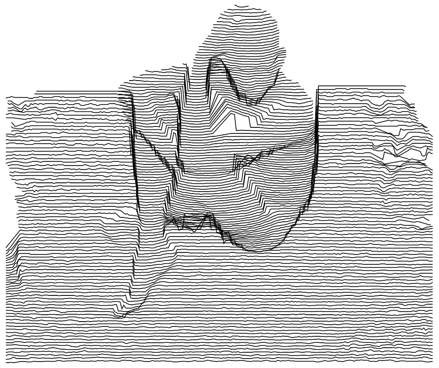

# nightgraph
A creative coding platform in Rust. Provides drawing APIs, a CLI, Native and WASM GUIs, and low-boilerplate artwork creation. Designed initially for [@night_generator](https://www.instagram.com/night_generator/) pen-plotter works, but steadily expanding into a general purpose platform.

### Status
This project is in **very early** active development, and probably shouldn't be used by anyone until it's first release in the near future 💜

With that said, there are a lot of exciting features on the roadmap:
- Scripting language and/or node editor for user created sketches at runtime.
- Keyframes/animations in `nightgraph-ui`, as well as rendering to various video formats
- Higher order geometric operations: clustering, fracturing, tiling, canvas-iterating operations.
- Forward-porting [@night_generator](https://www.instagram.com/night_generator/) works written in a previous version of this platform (such as Kinect scans).

and many more in this project's [issues](https://github.com/kneitinger/nightgraph/issues).

### Crates

#### [nightgraphics](./graphics)
A 2D drawing API, with a collection of shapes primitives as well as standard
operations on them, and between other shapes, and a canvas to place them on
and render from.

#### [nightsketch](./sketch)
An internal crate used by `nightgraph-ui` and `nightgraph-cli` to store, expose, and modify sketches (self contained works of art written in `nightgraphics`).

#### [nightgraph-ui](./ui)
A GUI written in [`egui`](https://github.com/emilk/egui) that displays `nightsketch` sketches, as well as auto-generated controls from their parameters. Runs natively on all Linux/MacOS/Windows, or in any modern web browser via `wasm`.

#### [nightgraph-cli](./cli)
A CLI for `nightsketch` sketches that lists sketches, their parameters, descriptions for both, and allows rendering sketches to SVGs with modified values.

#### [nightsketch_derive](./sketch_derive)
An internal crate that greatly simplifies the act of adding new sketches to `nightsketch`.  Through doc comments, attributes, and object naming, CLI/GUI controls are auto-generated for selection of sketches, setting of parameters, etc.

### Credit & Licenses

This project and its contained crates are licensed under the [MIT license](../LICENSE-MIT). Any artwork generated by _an existing_ sketch, such as `sketch/src/blossom.rs`, is licensed [CC BY 4.0](https://creativecommons.org/licenses/by/4.0/). Artwork can be attributed to Kyle Kneitinger (kyle@kneit.in), or [@night_generator](https://www.instagram.com/night_generator/) on Instagram.

`Jost-500-Medium.otf` and `Jost-400-Book.otf` by [indestructible type\*](https://indestructibletype.com/Jost.html), [SIL Open Font License](https://github.com/indestructible-type/Jost/blob/master/OFL.txt)

`Monofur_Regular.ttf` by Tobias Köhler, [Custom "Freeware" License](./ui/assets/Monofur_Regular_License.txt)

[`nightgraph-ui`](./ui) derived from [emilk/eframe_template](https://github.com/emilk/eframe_template)
