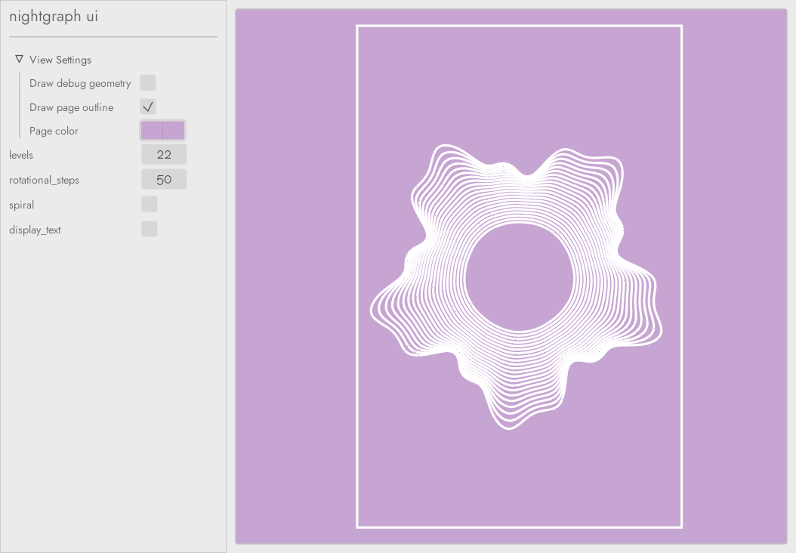

# nightgraph-ui
Native and wasm runners for [nightsketch](../sketch) sketches

## Status

This application is in heavy active development and features and appearance are
likely to change drastically in the coming release. Screenshots should be
treated like mock-ups at this point :)

## Overview

`nightgraph-ui` takes `nightsketch` sketches and presents their parameters as
interactive controls, and renders the sketch to the screen with options to
modify the page, stroke, etc.

## Current Screenshot

